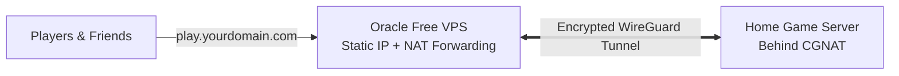

# Free VPS WireGuard Relay

[](LICENSE)
[](https://www.terraform.io/)
[](https://www.oracle.com/cloud/free/)
[](https://www.wireguard.com/)

Host dedicated game servers (Minecraft, Palworld, etc.) or homelab services from home with **zero monthly fees** and **no port forwarding required**. 

This stack automatically deploys an **Oracle Cloud Always Free VPS** to act as a secure, high-speed public relay that bypasses ISP CGNAT and routes players straight to your home machine.

---

## Table of Contents

- [How It Works](#how-it-works)
- [Free Tier & Cost Protection](#free-tier--cost-protection)
- [Prerequisites (by OS)](#prerequisites-by-os)
  - [Windows](#windows)
  - [macOS](#macos)
  - [Linux](#linux)
- [Step-by-Step Deployment](#step-by-step-deployment)
  - [Step 1: Set Up Oracle API Credentials](#step-1-set-up-oracle-api-credentials)
  - [Step 2: Clone & Configure](#step-2-clone--configure)
  - [Step 3: Deploy with Terraform](#step-3-deploy-with-terraform)
  - [Step 4: Point Your Domain (DNS)](#step-4-point-your-domain-dns)
  - [Step 5: Connect Your Home Server](#step-5-connect-your-home-server)
- [Customizing Game Ports](#customizing-game-ports)
- [Teardown / Cleanup](#teardown--cleanup)
- [Security Best Practices](#security-best-practices)
- [Disclaimers](#disclaimers)

---

## How It Works

If your home internet uses Carrier-Grade NAT (CGNAT), players cannot connect directly to your home IP address. 

This project sets up a lightweight cloud VPS with a static public IP and connects it to your home server over a fast, encrypted WireGuard tunnel. When players connect to your cloud IP or domain, traffic is forwarded instantly to your home machine.



---

## Free Tier & Cost Protection

This stack runs entirely within Oracle Cloud's **Always Free** tier:
- **Instance Specs**: 1 OCPU (ARM Ampere A1), 1 GB RAM, 50 GB Boot Volume.
- **Reclamation Protection**: Oracle only checks memory on ARM instances for idle reclamation. Running on 1 GB RAM ensures normal OS usage naturally stays above Oracle's 20% threshold (~25–35%), protecting your server from automatic deletion.
- **Spend Safeguard**: Includes an automated budget alert ([tf/budget.tf](tf/budget.tf)) that emails you if your account ever accrues even `$0.01` in charges.

| Feature | Standard Free Tier | Pay-As-You-Go (PAYG) Account |
| :--- | :--- | :--- |
| **Monthly Cost** | $0.00 | $0.00 (within free limits) |
| **Idle Reclamation** | 🛡️ Protected by 1 GB RAM threshold | ✅ Exempt from idle reclamation |
| **Host Capacity** | Lower priority during peak times | Highest priority (avoids "out of capacity" errors) |

> [!TIP]
> **Optional PAYG Upgrade**: Upgrading to a Pay-As-You-Go account bypasses ARM capacity shortages. Oracle places a temporary ~$100 authorization hold on your card for identity verification, which is **fully refunded/reversed**. You are never charged as long as you stay within the Always Free limits.

---

## Prerequisites (by OS)

Before you begin, make sure you have:
1. An **[Oracle Cloud Account](https://www.oracle.com/cloud/free/)** (Always Free).
2. The tools listed below for your operating system.

### Windows

1. **Install Git & Terraform**:
   Open PowerShell as Administrator:
   ```powershell
   winget install Git.Git HashiCorp.Terraform
   ```
2. **Generate an SSH Key** (press Enter to accept default path):
   ```powershell
   ssh-keygen -t ed25519
   ```
   *Your public key will be saved to: `C:\Users\<YourUsername>\.ssh\id_ed25519.pub`*

---

### macOS

1. **Install Git & Terraform**:
   Open Terminal:
   ```bash
   brew install git terraform
   ```
2. **Generate an SSH Key** (press Enter to accept default path):
   ```bash
   ssh-keygen -t ed25519
   ```
   *Your public key will be saved to: `~/.ssh/id_ed25519.pub`*

---

### Linux

1. **Install Git & Terraform** (Ubuntu/Debian example):
   ```bash
   sudo apt update && sudo apt install -y git snapd
   sudo snap install terraform --classic
   ```
   *(For other distributions, refer to the [HashiCorp Install Guide](https://developer.hashicorp.com/terraform/install)).*
2. **Generate an SSH Key** (press Enter to accept default path):
   ```bash
   ssh-keygen -t ed25519
   ```
   *Your public key will be saved to: `~/.ssh/id_ed25519.pub`*

---

## Step-by-Step Deployment

### Step 1: Set Up Oracle API Credentials

Terraform needs an API key to communicate with your Oracle Cloud account.

1. Sign in to the [Oracle Cloud Console](https://cloud.oracle.com/).
2. Click your profile avatar (top-right) → **My profile** (or **User Settings**).
3. Under **Resources** (bottom-left), click **API Keys** → **Add API Key**.
4. Select **Generate API Key Pair**, click **Download Private Key** (save as `oci_api_key.pem`), and click **Add**.
5. Copy the configuration text block displayed on screen.
6. Create or open your config file in a text editor:
   - **Windows**: `C:\Users\<YourUsername>\.oci\config`
   - **macOS / Linux**: `~/.oci/config`
7. Paste the snippet into the file and verify that `key_file` points to your downloaded `oci_api_key.pem` file.

---

### Step 2: Clone & Configure

1. Open your terminal and clone this repository:
   ```bash
   git clone https://github.com/FranzTamani/free-vps-wireguard-relay.git
   cd free-vps-wireguard-relay/tf
   ```

2. Create your settings file from the example:
   - **Windows (PowerShell)**:
     ```powershell
     Copy-Item terraform.tfvars.example terraform.tfvars
     ```
   - **macOS / Linux**:
     ```bash
     cp terraform.tfvars.example terraform.tfvars
     ```

3. Open `terraform.tfvars` in a text editor:
   ```hcl
   # Set your email for zero-spend safety notifications:
   budget_alert_email = "your-email@example.com"

   # Leave this blank for now (you will fill it in Step 5):
   home_peer_public_key = ""
   ```

---

### Step 3: Deploy with Terraform

Run the following commands from the `tf/` folder:

```bash
terraform init
terraform apply
```

Type `yes` when prompted. In 1–2 minutes, Terraform will complete the deployment and print a summary box with your **Reserved Public IP** and connection commands.

---

### Step 4: Point Your Domain (DNS)

In your domain registrar or DNS provider (Cloudflare, Namecheap, Porkbun, etc.), add an `A` record:

| Setting | Value |
| :--- | :--- |
| **Type** | `A` |
| **Name / Host** | `play` *(or `@` for root domain)* |
| **Target / IP** | `<your_reserved_public_ip>` |
| **Proxy Status** | **DNS Only (Grey Cloud)** *(Do NOT use Cloudflare HTTP proxy; it cannot route game packets)* |

---

### Step 5: Connect Your Home Server

Choose the guide matching the operating system running your **home game server**:

#### Option A: Home Server on Linux (Ubuntu / Debian)

1. **Install WireGuard**:
   ```bash
   sudo apt update && sudo apt install -y wireguard
   ```

2. **Generate your home keys**:
   ```bash
   wg genkey | tee home.key | wg pubkey > home.pub
   ```

3. **Update Terraform with your home key**:
   - Copy the string inside `home.pub`.
   - On the computer where you ran Terraform, open `tf/terraform.tfvars` and set:
     ```hcl
     home_peer_public_key = "PASTE_CONTENTS_OF_home.pub_HERE"
     ```
   - Run `terraform apply` (applies live to the VPS in seconds without restarting).

4. **Retrieve VPS key and generate client config**:
   - Get the VPS public key:
     ```bash
     terraform output wireguard_server_public_key_command
     ```
   - View your ready-made config template:
     ```bash
     terraform output -raw home_wireguard_config
     ```
   - Save this file to `/etc/wireguard/wg0.conf` on your home server, replacing the placeholder keys with `home.key` and the VPS public key.

5. **Start WireGuard**:
   ```bash
   sudo systemctl enable --now wg-quick@wg0
   ```

6. **Verify the connection**:
   ```bash
   ping 10.66.66.1
   ```

---

#### Option B: Home Server on Windows

1. **Install WireGuard**:
   Download the installer from [wireguard.com/install](https://www.wireguard.com/install/) or run:
   ```powershell
   winget install WireGuard.WireGuard
   ```

2. **Generate your home keys**:
   - Open the **WireGuard** app.
   - Click the arrow next to **Add Tunnel** → **Add empty tunnel...**.
   - WireGuard automatically generates a **Public key** and **Private key**. Copy the **Public key**.

3. **Update Terraform with your home key**:
   - On your deployment machine, edit `tf/terraform.tfvars`:
     ```hcl
     home_peer_public_key = "PASTE_WINDOWS_PUBLIC_KEY_HERE"
     ```
   - Run `terraform apply`.

4. **Configure the Tunnel**:
   - Fetch the VPS public key by running the command shown in:
     ```powershell
     terraform output wireguard_server_public_key_command
     ```
   - In the WireGuard Windows tunnel editor, enter:
     ```ini
     [Interface]
     PrivateKey = <auto-generated private key>
     Address = 10.66.66.2/24

     [Peer]
     PublicKey = <vps_wireguard_public_key>
     Endpoint = <your_vps_public_ip>:51820
     AllowedIPs = 10.66.66.1/32
     PersistentKeepalive = 25
     ```
   - Click **Save**, then click **Activate**.

5. **Verify the connection**:
   ```powershell
   ping 10.66.66.1
   ```

---

#### Option C: Home Server on macOS

1. **Install WireGuard**:
   Download from the [Mac App Store](https://apps.apple.com/us/app/wireguard/id1451685025) or via Homebrew:
   ```bash
   brew install wireguard-tools
   ```

2. **Generate your home keys**:
   - Open WireGuard → click **Add Tunnel** → **Add empty tunnel...**.
   - Copy the generated **Public key**.

3. **Update Terraform with your home key**:
   - Add the public key to `tf/terraform.tfvars`:
     ```hcl
     home_peer_public_key = "PASTE_MAC_PUBLIC_KEY_HERE"
     ```
   - Run `terraform apply`.

4. **Configure the Tunnel**:
   - Get the VPS public key:
     ```bash
     terraform output wireguard_server_public_key_command
     ```
   - Paste the configuration (using the same format as Windows above) and click **Save** → **Activate**.

5. **Verify the connection**:
   ```bash
   ping 10.66.66.1
   ```

---

🎉 **Setup Complete!** Players can now join your game servers using your domain (e.g., `play.yourdomain.com:25565` for Minecraft or `:8211` for Palworld).

---

## Customizing Game Ports

Ports forwarded by the VPS are managed in [tf/locals.tf](tf/locals.tf). You can enable, disable, or add custom games at any time:

```hcl
game_ports = {
  palworld_game     = { enabled = true,  protocol = "udp", port = 8211,  description = "Palworld game" }
  palworld_query    = { enabled = true,  protocol = "udp", port = 27015, description = "Palworld Steam query" }
  minecraft_java    = { enabled = true,  protocol = "tcp", port = 25565, description = "Minecraft Java" }
  minecraft_bedrock = { enabled = false, protocol = "udp", port = 19132, description = "Minecraft Bedrock" }
}
```

After modifying ports, simply run:
```bash
terraform apply
```
Changes sync to the VPS automatically within 5 minutes without restarting the machine.

---

## Teardown / Cleanup

To delete all cloud resources (VPS, IP address, virtual network, and budget alert):

```bash
cd tf
terraform destroy
```
Type `yes` when prompted. Everything in your Oracle tenancy created by this project will be removed cleanly.

---

## Security Best Practices

> [!WARNING]
> **Delete your OCI API key after deployment**
> 
> Once your VPS is deployed and running, you can safely delete the API signing key from the Oracle Console (**Profile → User Settings → API Keys**).
> 
> The running VPS operates independently and **never** needs your API key. Removing the key ensures that your Oracle account cannot be modified even if your local computer is compromised.
> 
> When you need to run updates or execute `terraform destroy`, simply generate a new key in the console and re-add it to your `.oci/config`.

---

## Disclaimers

> [!NOTE]
> **Project Disclaimer**: Developed with AI assistance. Configurations adhere to cloud security best practices and Oracle Cloud Always Free guidelines.
> 
> **Cost & Usage Disclaimer**: Provided under the MIT License "as is", without warranty. While designed to operate entirely within Always Free tier limits, you are solely responsible for monitoring your cloud tenancy. The author assumes no liability for charges, service changes, or account actions by Oracle.
