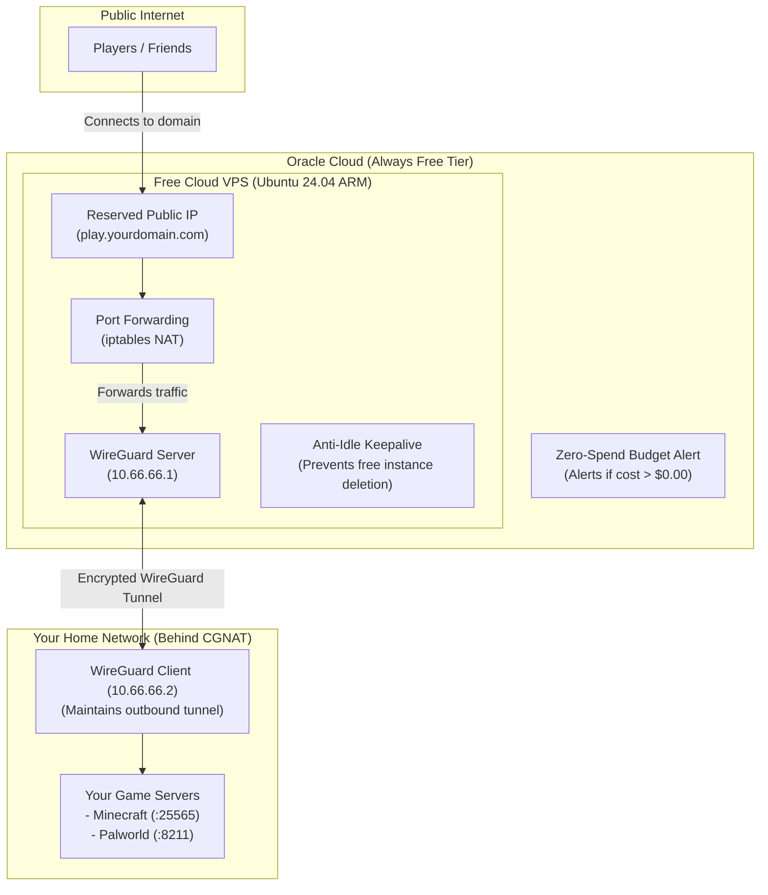

# Free VPS WireGuard Relay

Bypass ISP CGNAT to host dedicated game servers (Minecraft, Palworld, etc.) or homelab services from home with **zero monthly fees**, using an **Oracle Cloud (OCI) Always Free VPS** as an encrypted, high-performance WireGuard relay.

Compatible with both the **Local Terraform CLI** (zero-configuration auto-discovery) and **OCI Resource Manager**.

---

## How It Works in Simple Terms

If your home ISP uses CGNAT (Carrier-Grade NAT) or blocks inbound ports, players on the internet cannot connect directly to your home computer. 

This repository provisions a cloud server designed to run within Oracle Cloud's Always Free tier with a static public IP address. It sets up an encrypted WireGuard tunnel between the Oracle VPS and your home server. When players connect to your cloud IP or domain name, traffic is instantly forwarded through the encrypted tunnel directly to your game server at home.



---

## Free Tier: Standard (Non-PAYG) vs. Pay-As-You-Go (PAYG)

Both account types receive the exact same **$0 Always Free allowances**:
- **Compute**: Up to 2 OCPUs & 12 GB RAM (Ampere ARM A1).
- **Storage**: 200 GB total Block Volume (boot + storage).
- **Network**: 10 TB/month outbound data transfer & 1 free Reserved Public IPv4.

| Feature | Standard Free Tier (Non-PAYG) | Pay-As-You-Go (PAYG) |
| :--- | :--- | :--- |
| **Idle Reclamation** | ⚠️ **Active**: Oracle terminates instances if CPU and RAM stay below 20% for 7 days. | ✅ **Exempt**: Oracle never reclaims idle instances on paid/PAYG accounts. |
| **Anti-Idle Keepalive** | **Required**: Stack runs a low-priority task (`nice 19`) keeping load ~25%. | **Optional**: Set `anti_idle_enabled = false` in `terraform.tfvars`. |
| **A1 ARM Availability** | Low priority; frequent `Out of host capacity` errors. | High priority; easy to launch ARM instances. |
| **Spend Safety** | Hard limits; cannot incur accidental charges. | Protected by our built-in `$0.01` budget alert ([tf/budget.tf](tf/budget.tf)). |

> [!TIP]
> **Why Upgrade to PAYG?**
> Upgrading your account to Pay-As-You-Go (PAYG) requires a **temporary credit card authorization hold** (typically around ~$100 USD or local currency equivalent) to verify your account. This is **not a charge** and is **fully reversed/refunded** by Oracle shortly after verification. You will **not** be billed for running this VPS as long as you stay within the Always Free limits (enforced by this stack's guardrails). Upgrading gives you higher provisioning priority (bypassing `Out of host capacity` errors) and permanently turns off idle instance reclamation.

---

## Prerequisites

Before deploying, ensure you have the following ready:

1. **Oracle Cloud Account**: [Sign up for an OCI Account](https://www.oracle.com/cloud/free/).
2. **Git**: Installed on your computer ([Download Git](https://git-scm.com/downloads)).
3. **Terraform CLI** (v1.5.0+): Installed on your computer ([HashiCorp Install Guide](https://developer.hashicorp.com/terraform/install)).
   - *Windows (winget)*: `winget install HashiCorp.Terraform`
   - *macOS (Homebrew)*: `brew install terraform`
   - *Linux (Ubuntu/Debian)*: `sudo apt install terraform`
4. **OCI API Signing Key & CLI Config**:
   - Follow [Oracle Docs: Generating an API Signing Key](https://docs.oracle.com/en-us/iaas/Content/API/Concepts/apisigningkey.htm).
   - In the Oracle Console, click your profile icon (top right) > **My profile** (or **User Settings**) > **API Keys** > **Add API Key**.
   - Download the private key and copy the configuration snippet into `~/.oci/config` (or `C:\Users\<YourUsername>\.oci\config` on Windows). Detailed guide: [OCI SDK & Config Setup](https://docs.oracle.com/en-us/iaas/Content/API/Concepts/sdkconfig.htm).
5. **SSH Key Pair**:
   - Needed to log into your VPS without passwords. Follow [Oracle Docs: Generating SSH Keys](https://docs.oracle.com/en-us/iaas/Content/GSG/Tasks/creatingkeys.htm) or [GitHub SSH Key Guide](https://docs.github.com/en/authentication/connecting-to-github-with-ssh/generating-a-new-ssh-key-and-adding-it-to-the-ssh-agent).
   - *Quick command*: Run `ssh-keygen -t ed25519` in your terminal and press Enter to accept default location (`~/.ssh/id_ed25519.pub`).
6. **Home Linux Server**:
   - The computer hosting your game server with WireGuard installed ([WireGuard Installation](https://www.wireguard.com/install/)):
     ```bash
     sudo apt update && sudo apt install -y wireguard-tools
     ```

---

## Step-by-Step Deployment Guide

> **Note on Environments**:
> - **Steps 1 to 3**: Run on your local computer (where you run Terraform).
> - **Step 4**: Done in your web browser (your domain name registrar).
> - **Step 5**: Run on your home server (where your game server runs).

### Step 1: Clone the Repository & Enter Directory
Open your terminal (PowerShell, Command Prompt, or Linux/macOS terminal):

```bash
git clone https://github.com/FranzTamani/free-vps-wireguard-relay.git
cd free-vps-wireguard-relay/tf
```

### Step 2: Configure Your Settings
Copy the example variable template:

```bash
cp terraform.tfvars.example terraform.tfvars
```

Open `terraform.tfvars` in any text editor (Notepad, VS Code, nano):
```hcl
# Your email for zero-spend alerts (notifies you if spend ever reaches $0.01)
budget_alert_email = "your-email@example.com"

# Set to false if you upgraded your Oracle account to Pay-As-You-Go (PAYG)
anti_idle_enabled = true

# Leave empty for now; you will fill this in Step 5
home_peer_public_key = ""
```
*(Note: `terraform.tfvars` is in `.gitignore`, so your email and keys will never be accidentally committed to Git).*

### Step 3: Deploy to Oracle Cloud
Initialize the provider and run the deployment:

```bash
terraform init
terraform apply
```

Type `yes` when prompted to confirm. 

In about **1–2 minutes**, deployment will finish, and Terraform will print a complete summary box containing your server's **Reserved Public IP** and connection commands.

---

### Step 4: Map Your Domain (DNS)
Log in to where you manage your domain (Cloudflare, Namecheap, Porkbun, etc.) and create a new record:
- **Type**: `A`
- **Name**: `play` (or `@` for root domain)
- **Target / Value**: `<your_reserved_public_ip>`
- **Proxy Status**: **DNS Only (Grey Cloud)** *(Important: Cloudflare CDN cannot proxy UDP/game packets).*

---

### Step 5: Connect Your Home Server via WireGuard

Now switch to your **home game server**:

1. **Generate your home server keypair**:
   ```bash
   wg genkey | tee home.key | wg pubkey > home.pub
   ```

2. **Add your home public key to Terraform**:
   - Copy the string printed inside `home.pub`.
   - On your computer running Terraform, open `tf/terraform.tfvars` and paste it into `home_peer_public_key`:
     ```hcl
     home_peer_public_key = "PASTE_CONTENTS_OF_home.pub_HERE"
     ```
   - Run `terraform apply` on your computer. It applies live to the running VPS without rebooting!

3. **Fetch the VPS WireGuard public key**:
   Run the command provided in your Terraform summary output:
   ```bash
   terraform output wireguard_server_public_key_command
   # Example: ssh ubuntu@<public_ip> sudo cat /etc/wireguard/server.pub
   ```

4. **Set up the client configuration on your home server**:
   Print the ready-to-use client config from Terraform:
   ```bash
   terraform output -raw home_wireguard_config
   ```
   Save this to `/etc/wireguard/wg0.conf` on your home server. Replace `<contents of home.key>` with your `home.key` file content, replace `<server public key>` with the VPS public key, and activate the tunnel:
   ```bash
   sudo systemctl enable --now wg-quick@wg0
   ```

5. **Verify the tunnel**:
   ```bash
   ping 10.66.66.1
   ```
   If you get ping replies, congratulations! Your tunnel is active.

Players can now connect to your home game servers using your domain (for example, `play.yourdomain.com:25565` for Minecraft or `:8211` for Palworld)!

---

## Managing & Customizing Game Ports

All ports forwarded by the VPS are declared in [tf/locals.tf](tf/locals.tf). You can enable, disable, or add custom games anytime:

```hcl
game_ports = {
  palworld_game  = { enabled = true,  protocol = "udp", port = 8211,  description = "Palworld game" }
  palworld_query = { enabled = true,  protocol = "udp", port = 27015, description = "Palworld Steam query" }
  minecraft_java = { enabled = true,  protocol = "tcp", port = 25565, description = "Minecraft Java" }
}
```

Whenever you modify ports in `locals.tf`, simply run `terraform apply`. The VPS automatically syncs and applies your firewall rules within 5 minutes without restarting the machine.

---

## Teardown / Deletion Steps

If you ever wish to completely remove all resources (VPS, Reserved IP, VCN, budget alert):

```bash
cd tf
terraform destroy
```

Type `yes` when prompted. Everything created in your Oracle Cloud tenancy by this project will be deleted cleanly.

---

## ⚠️ Important Security Best Practice

> [!WARNING]
> **DELETE YOUR OCI API KEY ONCE DONE, RE-CREATE IF YOU WANT TO TEAR DOWN THE STACK**
>
> Once your VPS is deployed and running, you can safely delete the API signing key from the Oracle Console (**Profile / Identity > Users > Your User > API Keys**).
>
> The running VPS does **not** need your OCI API key to operate. Deleting the key from Oracle Console ensures that even if your personal computer is ever compromised, no credentials exist on disk that could manage your Oracle Cloud account.
>
> When you eventually want to update configuration or delete the stack with `terraform destroy`, simply generate a new API key in the console and re-add it to your `~/.oci/config`.

---

## Disclaimers & Limitations of Liability

> [!NOTE]
> **Project Disclaimer**: This project was developed with the assistance of AI. However, I have a professional background working in cloud infrastructure and cybersecurity. The architecture, security hardening, firewall controls, and Terraform configurations were designed and vetted against cloud security best practices and Oracle Cloud Always Free guidelines.
>
> **Cost & Usage Disclaimer**: This software is provided under the MIT License "as is", without warranty of any kind. While this stack is engineered to operate strictly within Oracle Cloud Infrastructure's Always Free tier limits and includes budget safeguards, you are solely responsible for monitoring your own cloud tenancy and usage. The author/s assume no liability for any charges, service modifications, or account actions by Oracle.
