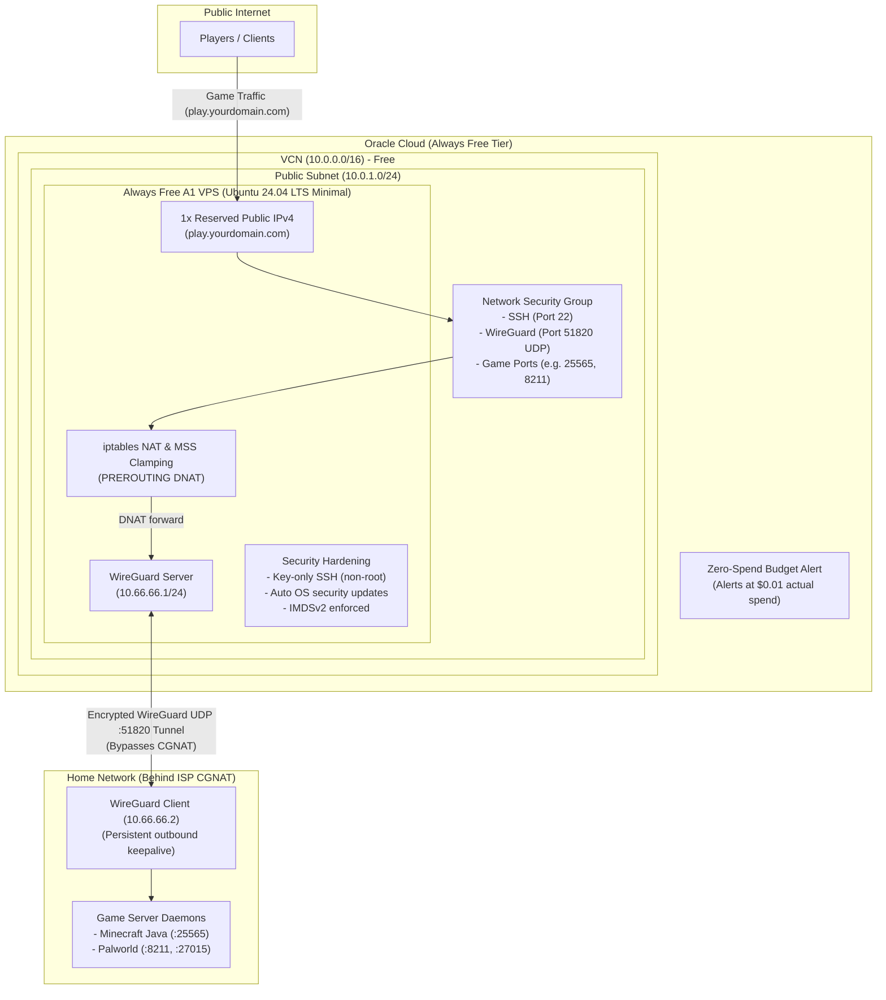

# Oracle Free VPS (Always Free WireGuard Game Relay)

Terraform stack designed for Oracle Cloud Infrastructure (OCI) **Always Free** tier to bypass ISP CGNAT for home-hosted game servers (Palworld, Minecraft, etc.) using WireGuard.

Compatible with both the **Local Terraform CLI** (zero-configuration auto-discovery) and **OCI Resource Manager**.

---

## Architecture Overview



---

## Features & Free Tier Guarantees

1. **Strict Always Free Guardrails (ARM A1 Only)**:
   - Restricted strictly to **Ampere ARM** (`VM.Standard.A1.Flex`) for maximum performance-per-dollar and dedicated network bandwidth (1 Gbps per OCPU).
   - **OCI Always Free Limits**: Oracle Cloud Infrastructure limits the Always Free Ampere A1 compute allocation to a maximum of **2 OCPUs and 12 GB of RAM** (totaling 1,500 OCPU hours and 9,000 GB hours per month).
   - **Instance Sizing**: This stack provisions **1 OCPU**, **6 GB RAM**, and a **50 GB block volume**, staying well within all Always Free thresholds while delivering dedicated 1 Gbps networking.
   - Built-in Terraform `precondition` blocks enforce these caps (max 2 OCPUs, 12 GB RAM, and 100 GB block storage).
   - Includes **1 OCI Reserved Public IP** (1 free per region) ensuring your public IP never changes across instance redeployments, so your DNS `A` records never break.
2. **Single Source of Truth ([tf/locals.tf](tf/locals.tf))**:
   - Everything (OCI compartments, instance shape, game ports, SSH keys, WireGuard CIDRs, update schedule) is configured cleanly in one place.
3. **Dual Deployment Support**:
   - **Local CLI**: Automatically discovers tenancy OCID, region, and default SSH key from your local environment with **zero manual configuration**.
   - **OCI Resource Manager (ORM)**: Automatically detects ORM execution, skips local file reads, and renders a clean UI form using [tf/schema.yaml](tf/schema.yaml).
4. **Least Privilege & Security Hardening**:
   - Default VCN Security List stripped to `deny-all`; all rules managed in an instance-specific NSG in [tf/network.tf](tf/network.tf).
   - No IAM instance principal / dynamic group attached (zero cloud API permissions).
   - OCI IMDSv2 enforced (legacy metadata disabled).
   - Root SSH disabled (`PermitRootLogin no`, `PasswordAuthentication no`). Access only via `ubuntu` with your SSH key.
5. **Self-Updating & In-Place Reconcile**:
   - **OS Level**: `unattended-upgrades` patches security vulnerabilities and schedules a reboot at off-peak hours (default 04:00).
   - **Config Level**: Systemd timer on the VPS polls instance metadata every 5 minutes. Updating ports or settings in `locals.tf` applies changes in place without rebuilding the instance.
   - **Git Self-Update (Optional flag)**: Can pull versioned management script updates from Git with syntax checks, health checks, and automatic rollback.
6. **Zero-Dollar Budget Guard**:
   - Optional budget alert that triggers if actual spend hits **$0.01**. Pass your email directly to the CLI command or environment variable without committing it to Git.
7. **Anti-Idle Keepalive (Reclamation Guard)**:
   - For free tier accounts, Oracle actively reclaims instances if CPU and memory utilization stay below 20% over 7 days.
   - Built-in background service (`vps-anti-idle.service`) maintains ~25% CPU and ~25% memory utilization to prevent instance reclamation.
   - Operates at lowest scheduling priority (`nice 19`, idle I/O class, OOM score 900) and automatically yields CPU/memory to user traffic.
   - Can be toggled on/off in `terraform.tfvars` or `locals.tf` (can be disabled on Pay-As-You-Go accounts).

---

## Free Tier Comparison: Standard (Non-PAYG) vs. Pay-As-You-Go (PAYG)

Oracle Cloud offers two account statuses that can access the **Always Free** tier. Both have access to the exact same $0 free resource allowances, but differ significantly in reclamation policies and capacity provisioning:

| Feature / Resource | Standard Free Tier (Non-PAYG) | Pay-As-You-Go (PAYG) |
| :--- | :--- | :--- |
| **Always Free Compute** | Up to **2 OCPUs & 12 GB RAM** (Ampere A1 ARM) | Up to **2 OCPUs & 12 GB RAM** (Ampere A1 ARM) |
| **Always Free Storage** | **200 GB** total block volumes (boot + block) | **200 GB** total block volumes (boot + block) |
| **Outbound Data Transfer**| **10 TB / month** free outbound data transfer | **10 TB / month** free outbound data transfer |
| **Public IPv4 Address** | **1x Reserved Public IPv4** free | **1x Reserved Public IPv4** free |
| **Idle Reclamation Policy** | ⚠️ **Active reclamation**: Instances with <20% CPU and <20% memory over 7 days (95th percentile) are stopped/reclaimed. | ✅ **Exempt from reclamation**: Paid/PAYG accounts are never reclaimed for inactivity, even at 0% load. |
| **Anti-Idle Keepalive** | **Recommended**: Keep `anti_idle_enabled = true` to maintain >20% load. | **Optional**: Set `anti_idle_enabled = false` for zero background load. |
| **A1 Capacity Allocation** | Low provisioning priority; frequent `Out of host capacity` errors in popular regions. | High provisioning priority; significantly higher chance to provision ARM instances. |
| **Cost & Billing Guard** | Cannot exceed limits (hard stops on free tier). | Guarded by built-in `budget.tf` alert ($0.01 threshold). Stays $0 if within limits. |

> [!TIP]
> **Why Upgrade to PAYG?**
> Upgrading your OCI account to Pay-As-You-Go (PAYG) does **not** cost money as long as you stay within the Always Free limits (enforced by this stack's Terraform preconditions). Upgrading bypasses host capacity bottlenecks and permanently eliminates Oracle's idle instance reclamation policy.
>
> If you choose to stay on **Standard Free Tier**, this stack includes an automated **Anti-Idle Keepalive** background task enabled by default to prevent your instance from being reclaimed.

---

## Prerequisites

Before deploying, ensure you have:

1. **Oracle Cloud Infrastructure (OCI) Account**:
   - Always Free or upgraded to **Pay-As-You-Go (PAYG)** (recommended for 24/7 uptime without idle reclamation).
2. **Pre-Authenticated Local OCI CLI Configuration**:
   - A valid configuration file at `~/.oci/config` (or `C:\Users\<Username>\.oci\config` on Windows) with an active API signing key.
3. **SSH Key Pair**:
   - An Ed25519 public key at `~/.ssh/id_ed25519.pub` (automatically picked up by default).
4. **Terraform CLI**:
   - Terraform **v1.5.0 or later** installed and available in your `PATH`.
5. **Home Server**:
   - Linux host running your game server(s) with `wireguard-tools` installed (`sudo apt install wireguard-tools`).

---

## Step-by-Step Deployment Commands

### Step 1: Open the Terraform Directory
```bash
cd tf
```

### Step 2: Initialize Terraform
Download the required Oracle Cloud Infrastructure provider:
```bash
terraform init
```

### Step 3: Configure Local Variables (Uncommitted)
To set sensitive or personalized values (such as your budget alert email or WireGuard public key) without committing them to Git, copy the example variable file:
```bash
cp terraform.tfvars.example terraform.tfvars
```
Edit `terraform.tfvars`:
```hcl
budget_alert_email   = "your-email@example.com"
home_peer_public_key = ""     # Add this in Step 7 once your home key is generated
anti_idle_enabled    = true   # Set to false if your account is upgraded to PAYG
```
> [!NOTE]
> `terraform.tfvars` is ignored by Git (`*.tfvars` in `.gitignore`) and is automatically loaded by Terraform during `plan` and `apply` without requiring extra CLI flags.

### Step 4: Review the Execution Plan
Generate and review the plan:
```bash
terraform plan
```
Terraform will automatically read your `~/.oci/config` profile, detect your tenancy and region, find the latest Ubuntu 24.04 ARM image, locate your `~/.ssh/id_ed25519.pub` file, and load `terraform.tfvars`.

### Step 5: Apply the Infrastructure
Deploy the stack to Oracle Cloud:
```bash
terraform apply
# Type 'yes' when prompted to confirm
```

Once deployment completes (~1–2 minutes), Terraform automatically prints the entire consolidated post-deployment summary and instructions block directly in your terminal.

You can also redisplay this complete summary at any time by running:
```bash
terraform output
```

---

## Post-Deployment Setup

Everything needed for post-deployment (DNS values, game endpoints, WireGuard commands) is included in the summary above:

### Step 6: Map Your DNS Record
From the summary output (or `terraform output dns_a_record_target`), configure your DNS provider (Cloudflare, Porkbun, Namecheap, etc.):
- **Type**: `A`
- **Name**: `play` (or `@` for root domain)
- **Target / Value**: `<reserved_public_ip>`
- **Proxy Status**: **DNS Only (Grey Cloud)** — *Crucial: do not proxy UDP or game traffic through Cloudflare HTTP CDN proxies.*

---

### Step 7: Connect Your Home Game Server via WireGuard

1. **Generate a WireGuard key pair on your home server**:
   ```bash
   wg genkey | tee home.key | wg pubkey > home.pub
   ```
2. **Add the home public key to `terraform.tfvars`**:
   Open `tf/terraform.tfvars` and paste the contents of `home.pub` into `home_peer_public_key`:
   ```hcl
   home_peer_public_key = "PASTE_CONTENTS_OF_home.pub_HERE"
   ```
   Apply the change (it updates in place on the running VPS within minutes without a rebuild):
   ```bash
   terraform apply
   ```

3. **Fetch the VPS WireGuard public key**:
   ```bash
   terraform output wireguard_server_public_key_command
   # Run the command printed, for example:
   ssh ubuntu@<public_ip> sudo cat /etc/wireguard/server.pub
   ```

4. **Install the WireGuard configuration on your home server**:
   Print the pre-formatted client config:
   ```bash
   terraform output -raw home_wireguard_config
   ```
   Save the output to `/etc/wireguard/wg0.conf` on your home server, insert your `home.key` content into `PrivateKey`, insert the VPS public key into `PublicKey`, and start the tunnel:
   ```bash
   sudo systemctl enable --now wg-quick@wg0
   ```

5. **Verify Connection**:
   On your home server, check tunnel status:
   ```bash
   sudo wg show
   ping 10.66.66.1
   ```

Your home server is now connected over WireGuard. Any players connecting to your domain or VPS IP (e.g., `play.yourdomain.com:25565` or `:8211`) will be routed directly to your home server behind CGNAT!
